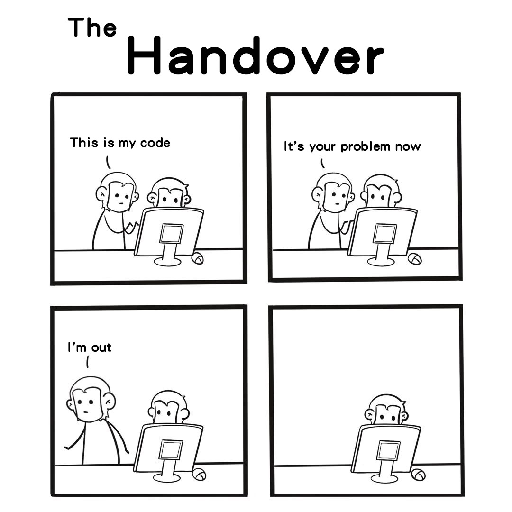
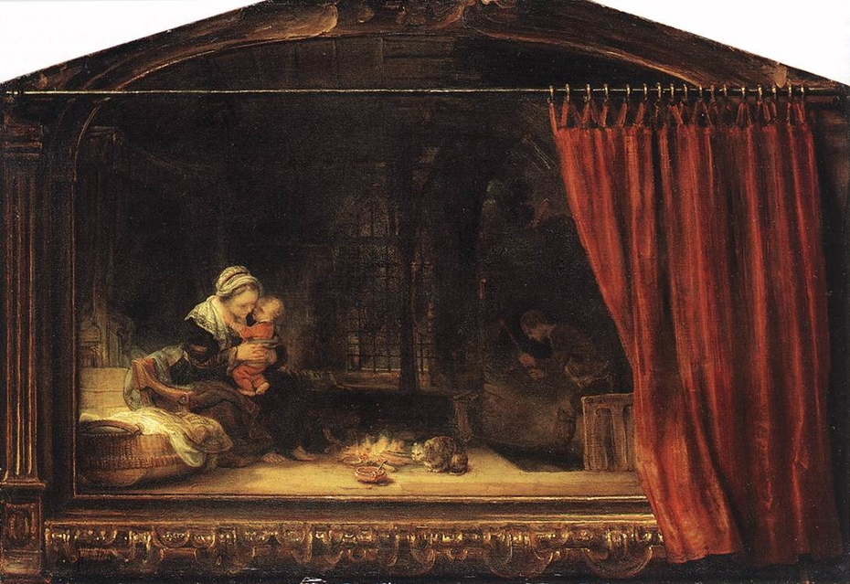
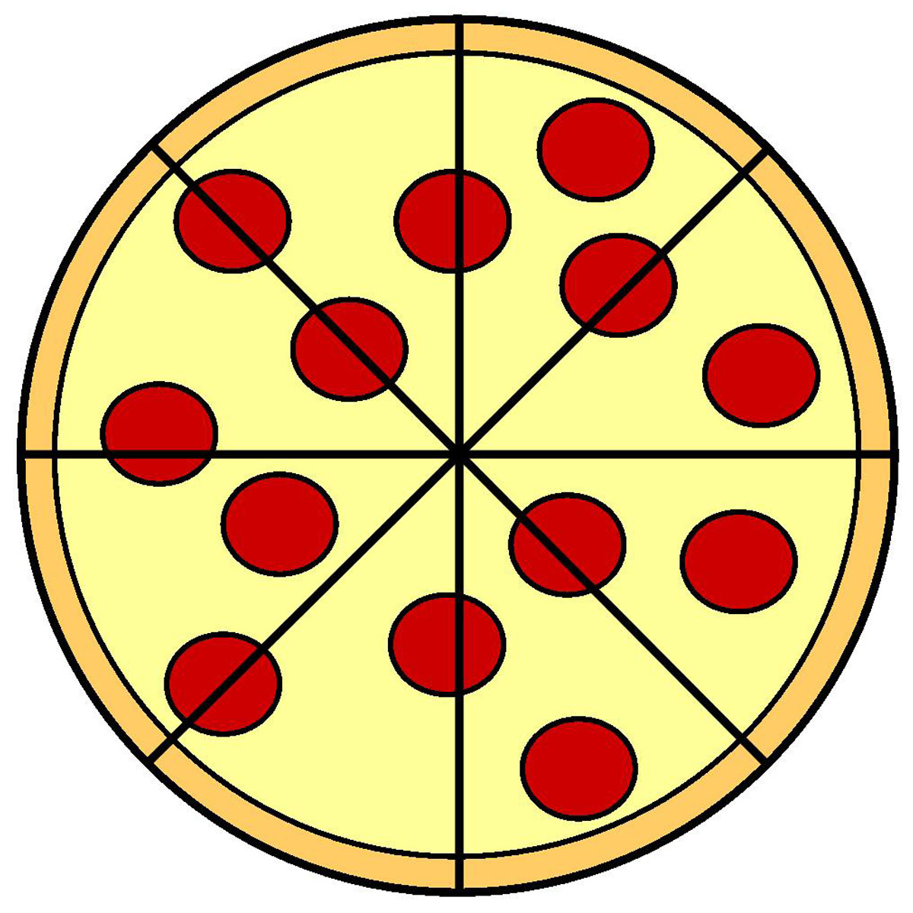
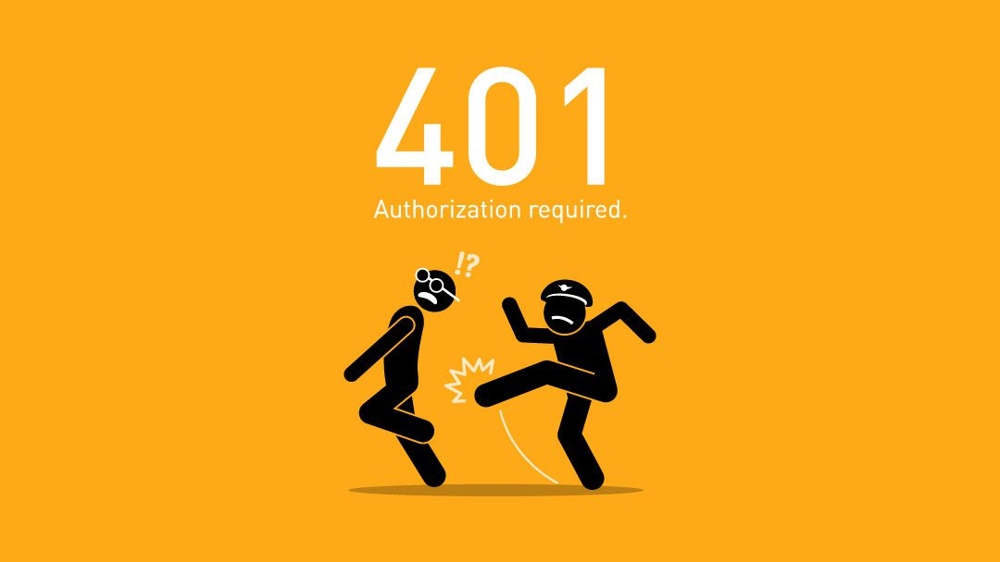
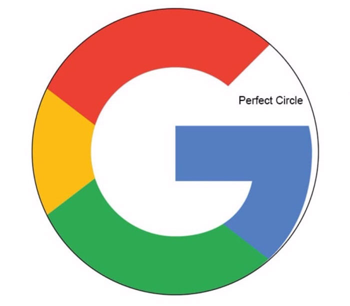
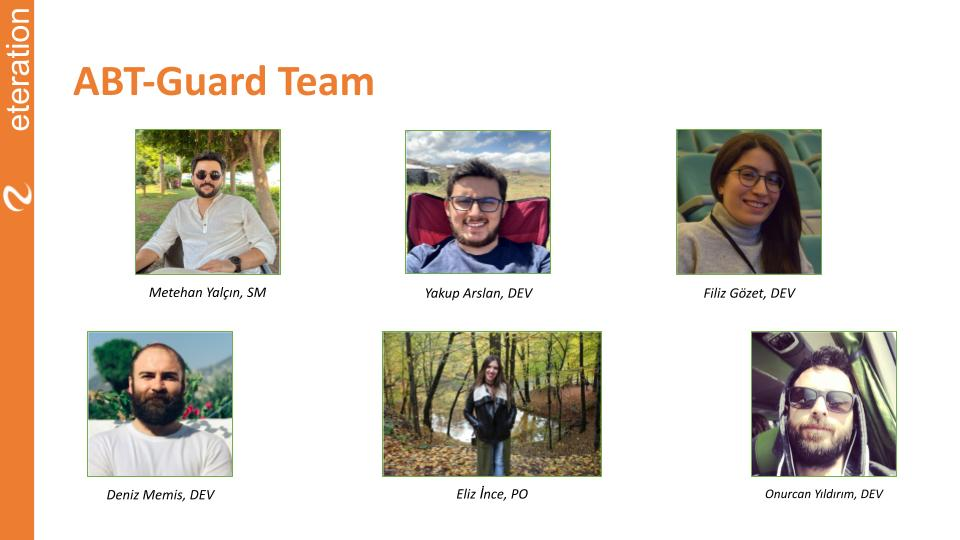
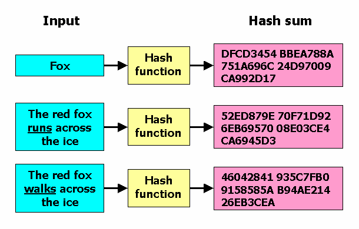
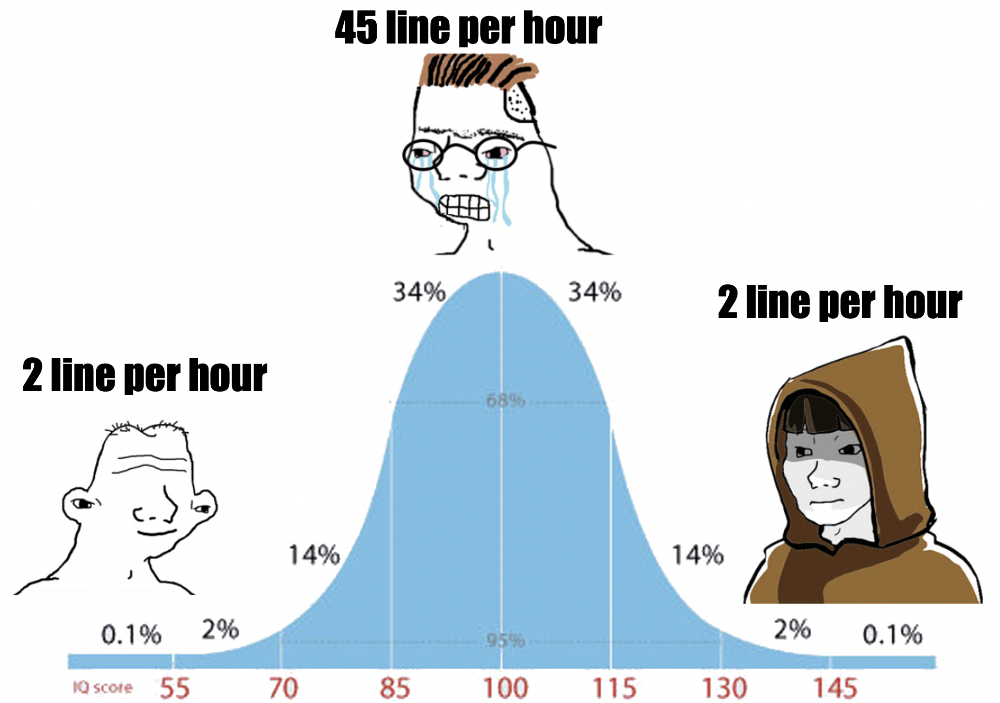

---

# who am i?

- avg stem grad
- masters w/o thesis in etm.
- pro softare slash r&d engineer.
- `denizmemis` @linkedin
- `d8niz` @github
- `deniz.memis` @eteration

---
# security, hello?

- what is up:
  - privacy
  - integrity
  - authentication
  - authorization

---
# privacy
- privus (single)
- privare (deprive)
- privatus (withdrawn from public)
- `belonging to or for the use of one particular person or group of people only`
- concern: info not captured or passed to a third party

---
# integrity
- integer (intact)
- ...,-2,-1,0,1,2,... 
- `the state of being whole and undivided`

- concern: info not compromised or altered

---
# authentication
- authenticus (genuine)
- authenticat (established as valid)
- `the process or action of proving or showing something to be true, genuine, or valid`

- concern: proof of identity

---
# authorization
- auctor (originator)
- auctorizare (approve)
- `give official permission for or approval to (an undertaking or agent)`

- concern: proof of permission

---
# cryptography
- make data incomprehensible (via a key)
- vocab:
  - `plaintext`: unencrypted data
  - `ciphertext`: encrypted data
  - `cipher`: technique/algo of encryption

---
# secret key (symmetric) cryptography
- same keys are used to encrypt/decrypt (voilà, la symétrie)
- the most fundamental problem of all other seem-to-be fundamental problems:
  - how to exchange keys for the very first time

---
# public key (asymmetric) cryptography
- two inversely related keys are used
  - public key: free to distribute
  - private key: kept secret by its owner

---
# key agreement protocols
- public key crypto can be used to distribute secret keys over insecure channels
- digital envelope:
  - message is encrypted using a symmetric key
  - symmetric key is encrypted using public key
  - send previous two as a whole package
  - to decrypt: 
    - first decrypt the symmetric key using the receiver’s
private key. 
    - then the symmetric key is used to decrypt actual message

---
# use-case-alert: abtguard
- observe the flow diagram

---
# hash function
- a.k.a message digest
- math function that assigns a hash value to a message
- i.e. md5, sha

---
# digital signatures
- solves problems of integrity and authentication
  - hash the original plaintext === mesage digest
  - encrypt message digest using sender's private key === digital signature to authenticate the sender
  - encrypt original message with receiver's public key === encrypted message
  - send {encrypted message + digital signature + hash function }

---
# digital signatures cont'd
- at the receiver side:
  - receive the whole package 
  - use sender's public key to decipher the digital signature, reveal message digest
  - use receiver's own private key to decipher the original message
  - apply the hash function to the original message
  - compare deciphered message and the result of the hash function

---
# public key infrastructure (pki)
- pki integrates public key crypto with digital certificates and certificate authorities (ca) to authenticate parties
in a transaction
- digital cert:
  - name of the subject
  - subject's public key
  - expiration date
  - other relevant stuff
- ca is financial institution or other trusted third party (verisign, thawte etc.)

---
# ca
- responsible for authentication
- certificates are publicly available in ca certificate repositories

---
# ca cont'd
- ca signes a cert by encrypting either the public key or the hash value
of the public key with it's own private key
- ca has to verify every individual's public key
- users must trust the public key of ca
- ca is a chain of certificates with the root certification (ipra) at index zero

---
# secure socket layer
- netscape
- de facto standard for an authenticated sv-client comm
- built into web browers and others
- private and secure transfer of information
- sits on top of TCP at transport layer
- operates independently and transparently of other protocols
- tls is the successor of ssl as an improved version

---
# secure socket layer cont'd
- authentication confirms clients
- encryption creates a secure tunnel btw two parties
- clients and servers confirm each other's ids using digital certs issued 
by ca
- ssl is comprised of two protocols:
  - handshake (key exchange)
  - record (bulk data transfer)

---
# ssl handshake
- authenticate sv to client (or the other way around) using assymetric techniques
- allows client and server to negotiate the cipher suite to be used
- allows client and server to generate symmetric session keys
- establishes the encrypted session
- once the key exchange is complete:
  - client and server use symmetric session keys to encrypt all comm

---
# ssl negotiation @web-browsers
- request for ssl session lands to the web server from browser
- server sends its digital signature (info about server and its public key)
- browser verifies cert and a ca is listed in its list of trusted ca's
- once verified browser generates a 48-byte master secret
- master secret is encrypted with server's public key and gets sent back to server
- server decrypts it using its own private key
- both server and browser now have the same secret key

---
# le fin
- speed != skill (turn your head slightly right)
- no memes are harmed or disgraced during this presentation...
- no capital letters are used...
- any questions... ty...
- have a lovely lunch...

